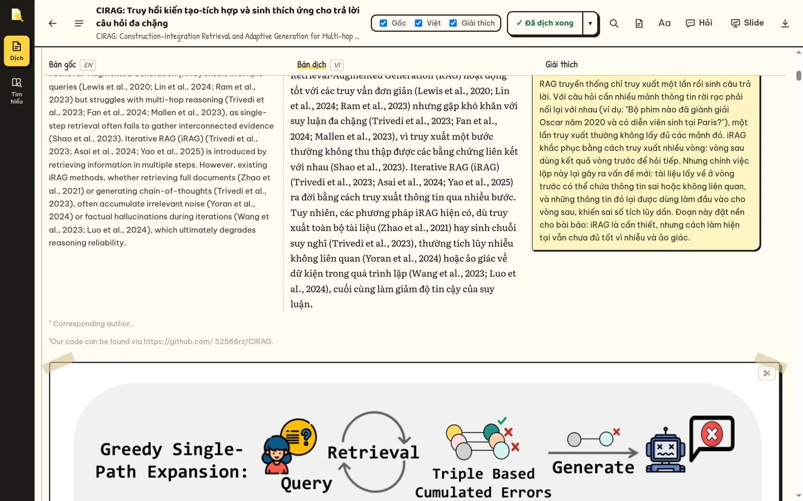
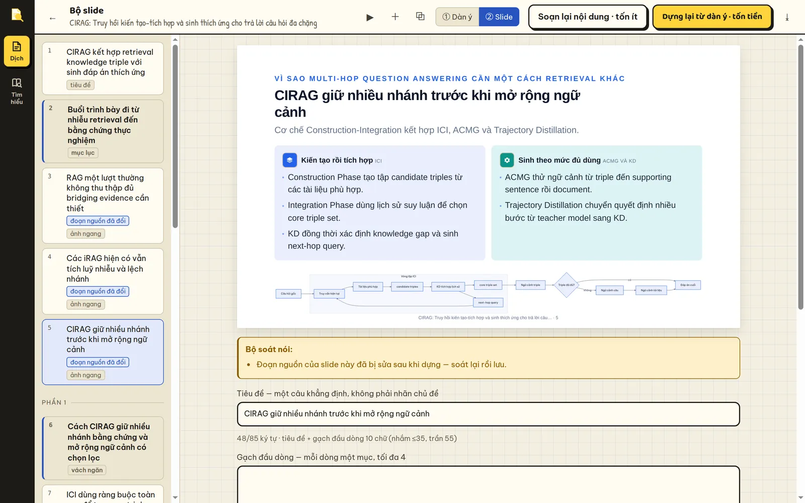

# Loupe

**Read English research papers in Vietnamese, without losing the argument.**

Loupe is a web app that runs on your own machine. It translates a paper
paragraph by paragraph, keeps the original next to every paragraph, and explains
what each one does in the paper's reasoning. It can also turn the paper into a
talk deck, and answer questions across a whole collection of papers.



Version 2.0.0 · [Changelog](CHANGELOG.md) · [Docker](DOCKER.md) ·
[Giới thiệu](docs/index.html) · [Hướng dẫn sử dụng](docs/huong-dan.html) ·
models via [OpenRouter](https://openrouter.ai)

---

## Quick start

You need Python 3.10+ and an [OpenRouter API key](https://openrouter.ai/keys).

```bash
./run.sh          # first run: creates .venv and .env, then stops
                  # put your key in .env as OPENROUTER_API_KEY=...
./run.sh          # second run: starts the app
```

Open <http://localhost:8010>, drop in a PDF, an arXiv link, Markdown or plain
text. Use `PORT=9000 ./run.sh` for another port, or see [DOCKER.md](DOCKER.md).

A typical paper costs **$0.04–0.10** to translate with the default model.
Everything before translation is free.

---

## What you can do

### Read a paper

- **Three aligned columns**: the original, the Vietnamese translation, and a
  plain-language explanation. Turn off a column you do not need and it is never
  generated, so you never pay for it.
- **A summary before you start**: the problem, the gap, the core idea, the
  method, the evidence and the limits, plus a glossary that stays fixed for the
  whole paper.
- **Figures, tables and equations** cropped from the PDF. Click "Figure 3" in the
  text to preview it, zoom in, or open the original PDF beside the text.
- **Highlights and notes** in five colours, a 💡 button that explains one
  paragraph in depth, and a chat that already has the full paper in context.
- **Fix anything by hand**, or re-translate a single paragraph. Your corrections
  are remembered for every paper that contains the same paragraph.

### Present it



- **One click, one model call** writes the whole deck in about a minute
  ($0.005–0.05). Pick 10, 15 or 20 minutes.
- **Each slide plays one role** in the paper's argument (problem, gap, idea,
  mechanism, worked example, evidence, key number, limits, takeaways), and each
  role has its own layout. The deck follows the argument instead of repeating
  one template.
- **Edit on the slide itself**, drag to reorder, swap figures, or ask for one
  slide to be rewritten.
- **Present in the browser** with speaker notes, or export a single offline
  HTML file or a PDF.
- **Numbers are checked**: a figure that does not appear in the paper's text is
  flagged or removed, and invented examples are labelled as illustrations.

### Export a report

Download the translation as **HTML** (one offline file), **PDF** (A4, page
numbers) or **Markdown**, bilingual or Vietnamese only. The HTML and PDF read
like a report: cover, argument summary, glossary, table of contents, then the
aligned text with explanations.

### Keep a library

Folders, tags, search and sorting. Authors, year and venue are looked up
automatically, and you can export BibTeX. Importing a paper you already have
asks first: open it, re-parse it, overwrite it, or keep the new file as v2.

### Ask across many papers

The **survey** tool indexes 20–50 papers and answers questions across them.
Every claim is cited down to the passage, and anything it could not find is
stated as not found. It can also write a synthesis of the whole collection and a
lecture that teaches one paper. It does not translate papers, so adding one costs
about $0.03.

---

## How it works

```
 1. PREPARE      free     PDF → paragraphs, headings, figures, tables, equations
                          You review the split, fix crops, and see the price.
                                         │ you confirm
                                         ▼
 2. TRANSLATE    paid     Read the whole paper → summary + fixed glossary
                          Translate in batches, three at a time
                          On demand: explanations, slides, highlights, chat
```

Three decisions make the translations reliable and cheap:

- **The whole paper is in context for every request.** Words like *while* or
  *since* get the right sense, and terms do not drift between sections.
- **Claims keep their strength.** The prompts forbid turning *may* into "will"
  or *suggests* into "proves".
- **The shared context is identical on every request**, so up to 99% of the
  input is read from the provider's cache at a fraction of the price.

---

## Cost

Measured on real papers with the default model, DeepSeek V4 Flash.

| Action | Typical cost |
|---|---|
| Import, splitting, figure crops, review | free |
| Translate a full paper with explanations | $0.04–0.10 (DeepSeek V4 Pro: $1–3) |
| Explain one paragraph | ~$0.003 |
| Build a slide deck | $0.005–0.05 |
| Add a paper to a survey | ~$0.03, once |
| Ask a survey question | ~$0.03 (asking again is free) |

Every action shows its price before you run it, and the running total for each
paper is shown in the side panel. You can translate only the sections you tick,
and stop at any time without losing finished work.

---

## Configuration

Settings live in `.env`:

| Variable | Purpose |
|---|---|
| `OPENROUTER_API_KEY` | **Required** |
| `OR_MODEL` | Translation model (default `~deepseek/deepseek-v4-flash-latest`) |
| `OR_MODEL_FAST` | Cheap model for clean-up tasks (default `qwen/qwen3.7-flash`) |
| `SURVEY_MODEL`, `SURVEY_FAST_MODEL` | Survey models; empty means the two above |
| `SURVEY_BUDGET` | Spending cap per survey question, in USD (default `0.50`) |
| `LAYOUT_BACKEND` | `mineru`, `docling` or `off` |
| `EMBED_BACKEND`, `RERANK_BACKEND` | `auto` or `off` (keyword search only) |
| `PAPER_DATA_DIR` | Where papers are stored (default `./data`) |

You can also switch models in the app, at import or while reading. Switching
never re-translates finished paragraphs.

| Model | Price per 1M tokens (in / out) | Notes |
|---|---|---|
| `~deepseek/deepseek-v4-flash-latest` | $0.09 / $0.18 | Default |
| `deepseek/deepseek-v4-pro` | $0.43 / $0.87 | Better quality, still cheap |
| `openai/gpt-5.6-terra` | $1 / $6 | |
| `anthropic/claude-sonnet-4.5` | $3 / $15 | Most fluent Vietnamese |

### Better figure and equation detection (optional)

Without a layout model, Loupe uses rules on top of PyMuPDF. A layout model finds
figures, tables and display equations far more reliably. On a 36-page paper with
7 numbered equations:

| Backend | Equations found | Time |
|---|---|---|
| Rules only | 0 / 7 | 2.8 s |
| Docling | 7 / 7 | ~196 s |
| **MinerU** | **7 / 7** | **6.2 s** |

```bash
.venv/bin/pip install "mineru[pipeline]"    # recommended; or: pip install docling
```

A GPU helps but is not required.

---

## Limitations

- **Scanned PDFs** need OCR first, for example with `ocrmypdf`.
- Tuned for one- and two-column computer-science papers. Posters and
  three-column layouts split less reliably. The review screen is where you catch
  this, before paying for anything.
- Equations are kept as text with sub- and superscripts. Display equations
  appear as images only when a layout model is installed.
- Reference lists are intentionally not translated.

---

## Development

```bash
.venv/bin/python -m pytest                          # full suite, ~3 minutes
.venv/bin/python -m pytest tests/test_unit.py -q    # pure logic, ~2 seconds
node --check web/*.js
```

The tests use a temporary data folder and fake every model call, so they cost
nothing and never touch your papers.

```
server/   FastAPI app: parsing, translation passes, prompts, slides, storage
  survey/ the multi-paper survey tool
web/      front end, plain JavaScript, no framework
docs/     landing page and Vietnamese user guide (served at /gioi-thieu/)
tests/    247 tests
```

Translation quality is decided in `server/prompts.py` and
`server/survey/prompts.py`; the rest is plumbing. Code comments, prompts and the
interface are in Vietnamese, because that is who the tool is for.
[`CLAUDE.md`](CLAUDE.md) documents the architecture and the traps already found.
Read it before changing the parser, the shared prompt context or the
translation format.
